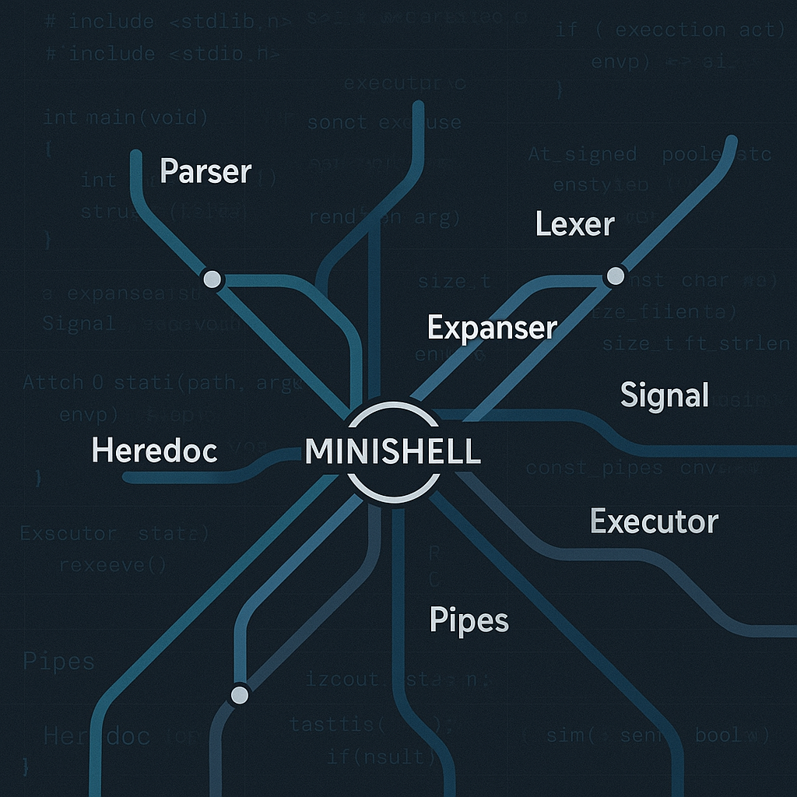
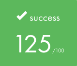

# 🐚 MINISHELL - Recreating(re-creating) a small Shell 🐚

  

### *MINI-HEAVEN, it speaks by itself*

## 🎯 ABOUT 🎯

This project is about creating a simple shell. Yes, your own little bash. You will learn a lot about processes and file descriptors.
The existence of shells is linked to the very existence of IT. At the time, all developers agreed that communicating with a computer using aligned 1/0 switches was seriously annoying. It was only logical that they came up with the idea of creating a software to communicate with a computer using interactive lines of commands in a language somewhat close to the human language.

#### 📖 [Read the subject here](.assets/minishell.pdf)

# 📚 Program Components

### 1. [Initialisation](SRCS/1.INITIALISATION) 🚀
- Shell environment setup and configuration
- Memory allocation for core structures
- Signal handlers initialization
- Terminal settings configuration

### 2. [Lexing](SRCS/2.LEXING) 🔍
- Token recognition and classification
- Character-by-character input analysis
- Special character identification (pipes, redirections, quotes)
- Input stream tokenization

### 3. [Checking](SRCS/3.CHECKING) ✅
- Syntax validation and error detection
- Quote matching verification
- Command structure validation
- Input sanitization and verification

### 4. [Parsing](SRCS/4.PARSING) 🧩
- Abstract syntax tree construction
- Command line structure analysis
- Argument and option separation
- Command pipeline organization

### 5. [Expansion](SRCS/5.EXPANSION) 🔄
- Environment variable expansion
- Quote removal and processing
- Wildcard and pattern matching
- Variable substitution handling

### 6. [Builtins](SRCS/6.BUILTINS) 🔧
- Built-in command implementations
- `echo`, `cd`, `pwd`, `export`, `unset`, `env`, `exit`
- Environment manipulation functions
- Shell-specific command handling

### 7. [Processing](SRCS/7.PROCESSING) ⚙️
- Command preparation and setup
- Process environment configuration
- File descriptor management
- Pre-execution processing

### 8. [Execution](SRCS/8.EXECUTION) ⚡
- Command execution and process management
- Pipe implementation and handling
- Input/Output redirection
- External command launching

### 9. [Utils](SRCS/9.UTILS) 🛠️
- Helper functions and utilities
- Memory management functions
- String manipulation tools
- Common operations and support functions

### 10. [Display](SRCS/10.DISPLAY) 🖥️
- Terminal output formatting
- Error message display
- User interface elements
- Visual feedback and presentation

## 🖥️ Shell Features

##### Our Minishell implements essential shell functionality:
- 🔍 Command parsing and execution with proper PATH handling
- 📁 Directory navigation with built-in `cd` command
- 🌐 Environment variable management and expansion
- 🔀 Pipe operations for command chaining
- 📝 Input/Output redirections (`<`, `>`, `>>`)
- 💬 Quote handling (single and double) for arguments
- ⚡ Built-in commands: `echo`, `cd`, `pwd`, `export`, `unset`, `env`, `exit`

##### Bonus features implemented:
- 🎯 Logical operators: `&&` (AND) and `||` (OR)
- 🔄 Parentheses for command grouping and precedence
- 🌟 Advanced command flow control

##### Key challenges overcome:
- Process management and fork handling
- Signal management (SIGINT, SIGQUIT)
- Memory leak prevention
- Complex parsing logic with operator precedence
- Error handling and edge cases
- Bonus operator implementation

## 🔍 Project Details

  

| 🎯 Key Learning Outcomes | 🛠️ Skills Developed |
|:------------------------|:-------------------|
| • Process management • Signal handling • Parsing algorithms • System calls mastery | • Unix • Rigor • Algorithms & AI • Group project |

### ⏰ Hours Spent: ~200 hours
### 👥 Team project with [@AwTaS](https://github.com/AwTaS)

## ⭐ Results

### Validated on 9 June, 2025

