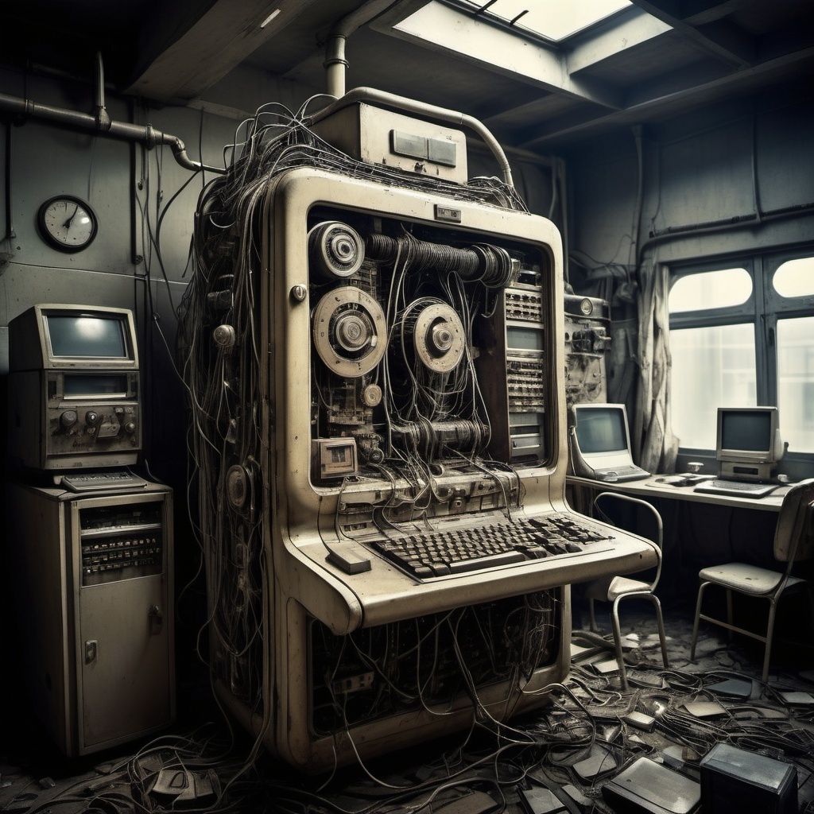
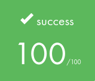

# 🖥️ BORN2BEROOT - My First System Administration Project 🖥️

  

### *...or Born 2 Reboot ?* 💡

## 🎯 ABOUT 🎯

This project aims to introduce ourselves to the WONDERFUL world of virtualization.
We'll create our first machine in VirtualBox under specific and strict rules.
This will be our first step into system administration.

#### 📖 [Read the subject here](.assets/b2br.en.pdf)

# 📚 Project Requirements

### 1. System Setup 🛠️
- Debian/Rocky Linux installation
- LVM partition setup
- SSH service configuration
- UFW firewall setup
- Strong password policy
- Sudo configuration

### 2. Additional Services 🔧
- Password aging configuration
- Hostname and users setup
- Monitoring script (wall)
- Cron configuration

## 🔍 Project Details

  

| 🎯 Key Learning Outcomes | 🛠️ Skills Developed |
|:------------------------|:-------------------|
| • Virtualization • System Administration • Network Security • Service Management | • Rigor • Network & System Administration • Security • Shell |

### ⏰ Hours Spent: ~40 hours

## ⭐ Results

### Validated on November 9, 2024

