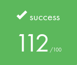

# 📖 GET_NEXT_LINE - Reading a line from a fd 📖

  

### *Reading between the lines, or at least, the next one* 💡

## 🎯 ABOUT 🎯

This project consists of coding a function that reads a line from a file descriptor.
A key step to understand how files are handled on C, how the memory works and what a double free is. A useful function for our next days at 42.

#### 📖 [Read the subject here](.assets/gnl.en.pdf)

# 📚 GNL Functions

### 1. Main Functions 🎯
- [`get_next_line`](get_next_line.c) - Main function that reads and returns a line
- [`get_next_line_utils`](get_next_line_utils.c) - Helper functions

### 2. Bonus Functions 🌟
- [`get_next_line_bonus`](get_next_line_bonus.c) - Handle multiple file descriptors
- [`get_next_line_utils_bonus`](get_next_line_utils_bonus.c) - Bonus helper functions

## 🔍 Project Details

  

| 🎯 Key Learning Outcomes | 🛠️ Skills Developed |
|:------------------------|:-------------------|
| • Static variables • File descriptors • Buffer management • Memory optimization | • Unix • Rigor • Algorithms & AI • Imperative Programming |

### ⏰ Hours Spent: ~40 hours

## ⭐ Results

### Validated on October 27, 2024

