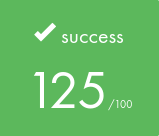

# 📚 LIBFT - My Very First Own Library of Functions 📚

  

### *Of course you'll need it!* 💡

## 🎯 ABOUT 🎯

This project is the first step of my journey at 42Lausanne, after succeeding the Piscine.
Libft is a fundamental project that we'll build and use throughout the cursus. It consists of coding basic C functions and assembling them to create my first library.

#### 📖 [Read the subject here](DOCS/Libft.en.pdf)

# 📚 LIBFT Functions Categories

### 0. Header File 📎
- [`libft.h`](libft.h) - Main header file containing all function prototypes and necessary includes

### 1. Character Testing Functions 🔍
- [`ft_isalpha`](ft_isalpha.c) - Check if character is alphabetic
- [`ft_isdigit`](ft_isdigit.c) - Check if character is digit
- [`ft_isalnum`](ft_isalnum.c) - Check if character is alphanumeric
- [`ft_isascii`](ft_isascii.c) - Check if character is ASCII
- [`ft_isprint`](ft_isprint.c) - Check if character is printable
- [`ft_isnumber`](ft_isnumber.c) - Check if string is numeric

### 2. String Manipulation Functions 📝
- [`ft_strlen`](ft_strlen.c) - Get string length
- [`ft_strlcpy`](ft_strlcpy.c) - Copy string with size limit
- [`ft_strlcat`](ft_strlcat.c) - Concatenate strings with size limit
- [`ft_strchr`](ft_strchr.c) - Find first occurrence of character
- [`ft_strrchr`](ft_strrchr.c) - Find last occurrence of character
- [`ft_strncmp`](ft_strncmp.c) - Compare n characters of strings
- [`ft_strcmp`](ft_strcmp.c) - Compare strings
- [`ft_strnstr`](ft_strnstr.c) - Find substring with length limit
- [`ft_strdup`](ft_strdup.c) - Duplicate string
- [`ft_substr`](ft_substr.c) - Extract substring
- [`ft_strjoin`](ft_strjoin.c) - Join two strings
- [`ft_strtrim`](ft_strtrim.c) - Trim characters from string
- [`ft_split`](ft_split.c) - Split string into array
- [`ft_strmapi`](ft_strmapi.c) - Map function to string
- [`ft_striteri`](ft_striteri.c) - Iterate through string

### 3. Memory Management Functions 💾
- [`ft_memset`](ft_memset.c) - Fill memory with constant byte
- [`ft_bzero`](ft_bzero.c) - Zero out memory
- [`ft_memcpy`](ft_memcpy.c) - Copy memory area
- [`ft_memmove`](ft_memmove.c) - Move memory area
- [`ft_memchr`](ft_memchr.c) - Find byte in memory
- [`ft_memcmp`](ft_memcmp.c) - Compare memory areas
- [`ft_calloc`](ft_calloc.c) - Allocate and zero memory

### 4. Conversion Functions 🔄
- [`ft_atoi`](ft_atoi.c) - Convert string to integer
- [`ft_atol`](ft_atol.c) - Convert string to long
- [`ft_itoa`](ft_itoa.c) - Convert integer to string
- [`ft_tolower`](ft_tolower.c) - Convert to lowercase
- [`ft_toupper`](ft_toupper.c) - Convert to uppercase

### 5. Output Functions 📤
- [`ft_putchar`](ft_putchar.c) - Output character
- [`ft_putchar_fd`](ft_putchar_fd.c) - Output character to fd
- [`ft_putstr`](ft_putstr.c) - Output string
- [`ft_putstr_fd`](ft_putstr_fd.c) - Output string to fd
- [`ft_putendl_fd`](ft_putendl_fd.c) - Output string with newline to fd
- [`ft_putnbr`](ft_putnbr.c) - Output number
- [`ft_putnbr_fd`](ft_putnbr_fd.c) - Output number to fd
- [`ft_putunbr`](ft_putunbr.c) - Output unsigned number
- [`ft_puthex`](ft_puthex.c) - Output hexadecimal
- [`ft_putptr`](ft_putptr.c) - Output pointer

### 6. Linked List Functions (Bonus) 🔗
- [`ft_lstnew`](ft_lstnew_bonus.c) - Create new list node
- [`ft_lstadd_front`](ft_lstadd_front_bonus.c) - Add node at front
- [`ft_lstadd_back`](ft_lstadd_back_bonus.c) - Add node at back
- [`ft_lstsize`](ft_lstsize_bonus.c) - Get list size
- [`ft_lstlast`](ft_lstlast_bonus.c) - Get last node
- [`ft_lstdelone`](ft_lstdelone_bonus.c) - Delete single node
- [`ft_lstclear`](ft_lstclear_bonus.c) - Delete list
- [`ft_lstiter`](ft_lstiter_bonus.c) - Iterate through list
- [`ft_lstmap`](ft_lstmap_bonus.c) - Map function to list

### 7. Utility Functions 🛠️
- [`ft_swap`](ft_swap.c) - Swap two integers
- [`ft_split_free`](ft_split_free.c) - Free split array
- [`found_newline`](../found_newline.c) - Find newline in string

> Note: Several functions were added to enhance the library beyond the project's requirements.

## 🔍 Project Details

  

### 🎯 Key Learning Outcomes
- Deep understanding of C programming fundamentals
- Memory management mastery
- Data structures implementation
- Code optimization techniques
- Rigorous testing methodology

### 🛠️ Skills Developed
- Algorithms & AI
- Imperative Programming
- Unix
- Rigor

### ⏰ Hours Spent: ~70 hours

  

  

    
  

## ⭐ Results

### Validated on October 11, 2024

