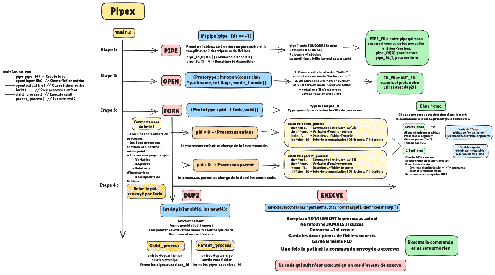

# 🔄 PIPEX - Redirections and Pipes Handler 🔄

  

### *Tunnel, pipe, tunnel, pipe, tunnel, pipe, tunn....* 💡

## 🎯 ABOUT 🎯

This project aims to deepen our understanding of two concepts we discovered in shell: Redirections and Pipes. Goal is to code the pipe operator (|) behavior. From basic pipes to here_doc and multiple commands handling, we'll dive into the fascinating world of processes communication.
You said you had your own printf? Now you have your own pipeline 😎

#### 📖 [Read the subject here](.assets/PIPEX.pdf)

# 📚 Project Components

### 1. Main Functions 🎯
- [`main.c`](main.c) - Core program execution
- [`pipex.h`](pipex.h) - Header file with prototypes and includes

### 2. Process Functions 🔄
- [`parse.c`](parse.c) - Command parsing
- [`paths.c`](paths.c) - PATH handling and command finding
- [`utils.c`](utils.c) - Utility functions

### 3. Bonus Features ⭐
- [`pipex_bonus.h`](bonus/pipex_bonus.h) - Header file for bonus part
- [`main_bonus.c`](bonus/main_bonus.c) - Core bonus execution
- [`parse_bonus.c`](bonus/parse_bonus.c) - Enhanced command parsing
- [`paths_bonus.c`](bonus/paths_bonus.c) - PATH handling for bonus
- [`utils_bonus.c`](bonus/utils_bonus.c) - Bonus utility functions
- [`here_doc.c`](bonus/here_doc.c) - Here_doc implementation

#### Features included:
- Multiple pipes handling (`|`)
- Here_doc support (`<<` heredoc)
- Input/Output redirection handling (`<`, `>`, `>>`)
- Multiple commands execution

## 💭 How it Works

## 🔍 Project Details

  

| 🎯 Key Learning Outcomes | 🛠️ Skills Developed |
|:------------------------|:-------------------|
| • Unix processes • File descriptors • Pipes management • Fork handling | • Unix • Imperative Programming • Rigor • Process Management |

### ⏰ Hours Spent: ~35 hours

## ⭐ Results

### Validated on January 15, 2025

