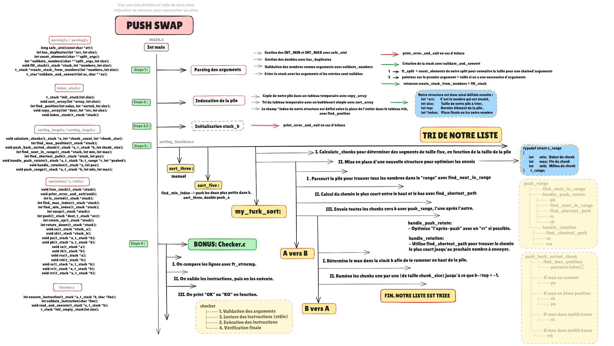
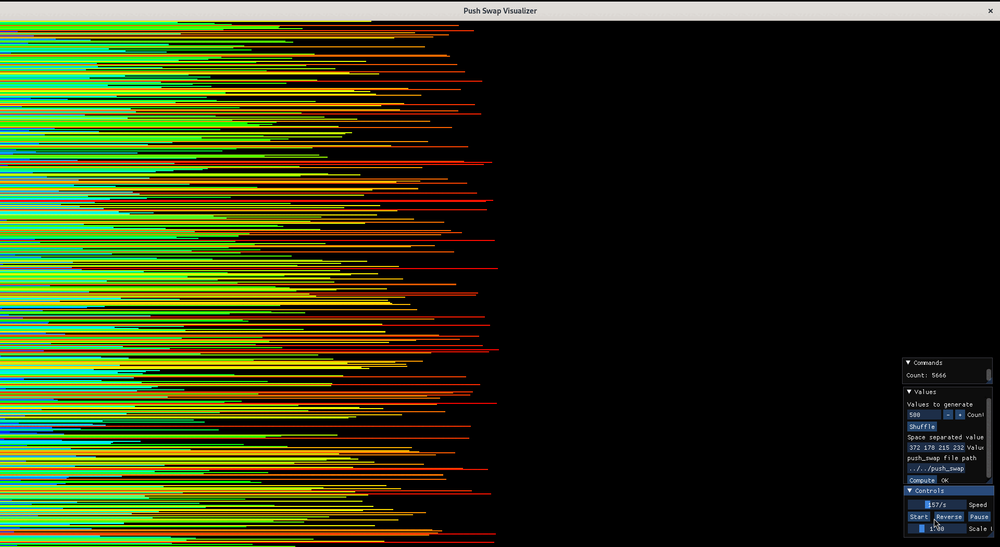
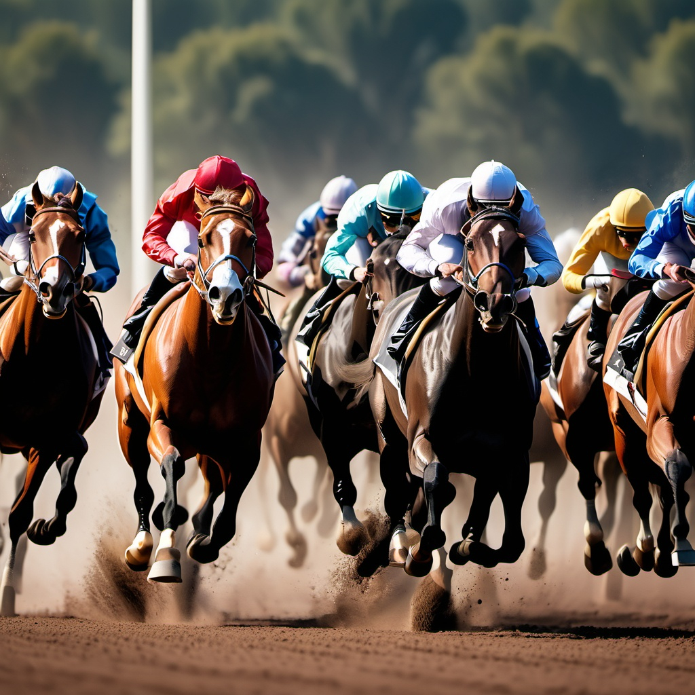

# 🔄 PUSH_SWAP - Stack Sorting Algorithm 🔄

  

### *Push me - And then just swap me -'Til I can get my - SATISFACTION* 💡

## 🎯 ABOUT 🎯

This project involves sorting data on a stack, with a limited set of instructions, and the smallest number of moves.
To achieve this, we created a hybrid approach combining chunk sorting efficiency with Turkish algorithm move optimization. Nothing's more beautiful than diversity and love... between algorithms 💘
#### 📖 [Read the subject here](.assets/PUSH_SWAP.pdf)

### 1. Main Functions 🎯
- [`main.c`](main.c) - Program entry point
- [`push_swap.h`](push_swap.h) - Header file with prototypes

### 2. Operations 🔄
- [`operations1.c`](operations1.c) - Basic operations implementation
- [`operations2.c`](operations2.c) - Stack operations (sa, sb, pa, pb)
- [`operations3.c`](operations3.c) - Rotation operations (ra, rb, rra, rrb)
- [`operations4.c`](operations4.c) - Combined operations (ss, rr, rrr)

### 3. Algorithm Components 🧮
- [`sorting_functions.c`](sorting_functions.c) - Main sorting algorithms
- [`sorting_large1.c`](sorting_large1.c) - Large stack sorting utilities
- [`sorting_large2.c`](sorting_large2.c) - Additional sorting functions

### 4. Utils & Parsing 🛠️
- [`parsing1.c`](parsing1.c) - Input validation
- [`parsing2.c`](parsing2.c) - Arguments handling
- [`utils.c`](utils.c) - Utility functions
- [`index_stack.c`](index_stack.c) - Stack indexing

### 5. Bonus Features ⭐
- [`checker.c`](checker.c) - Input validation program

### 6. Testing Scripts 🧪
- [`test.sh`](test.sh) - W/ my checker
- [`test_100.sh`](test_100.sh) - W/ school checker

## 💭 Sketches

## 🎬 Algorithm in Action

# 📊 Performance Stats

| Stack Size | Average Moves | Best Case | Worst Case |
|:----------:|:------------:|:---------:|:----------:|
| 100 | 660 | 630 | 690 |
| 500 | 5480 | 5220 | 5700 |

## 🔍 Project Details

  

| 🎯 Key Learning Outcomes | 🛠️ Skills Developed |
|:------------------------|:-------------------|
| • Sorting algorithms • Stack operations • Algorithm optimization • Performance analysis | • Rigor • Unix • Algorithms & AI • Imperative Programming |

### ⏰ Hours Spent: ~50 hours

## ⭐ Results

### Validated on December 30, 2024

