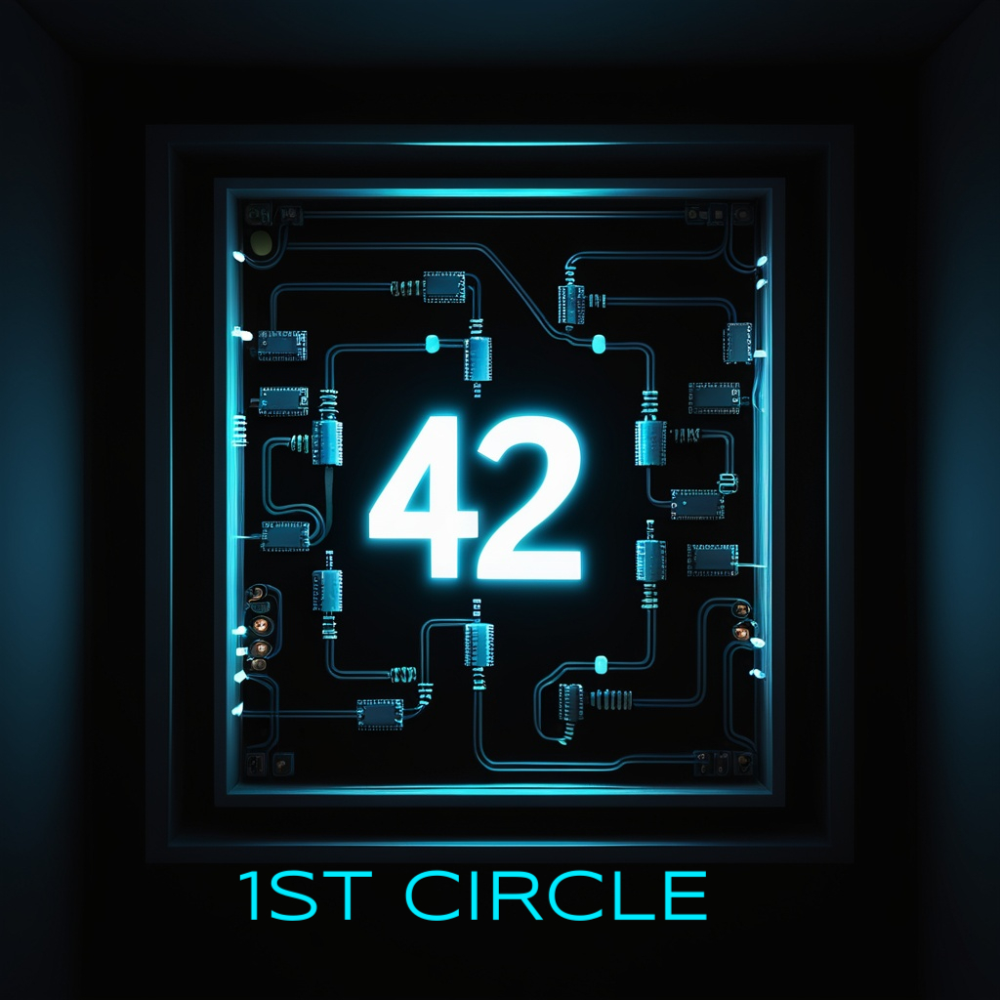
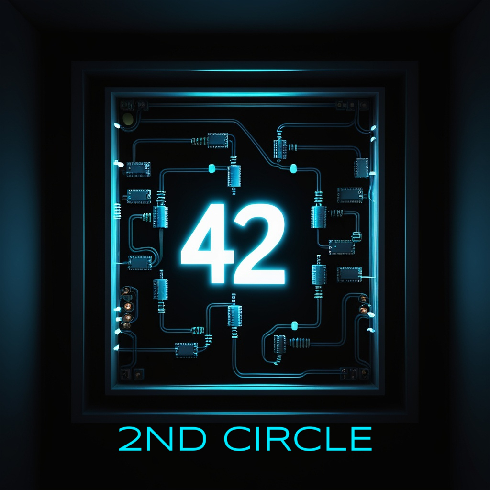
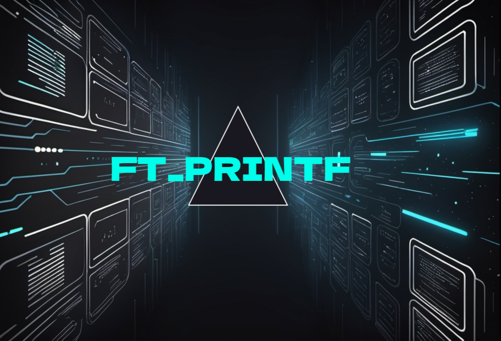
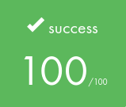
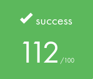
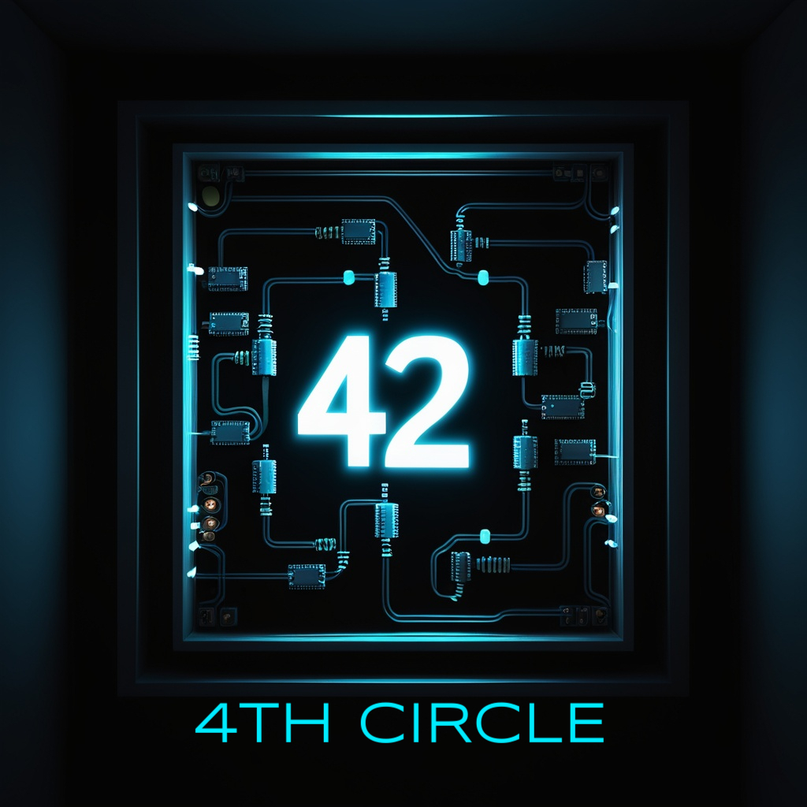
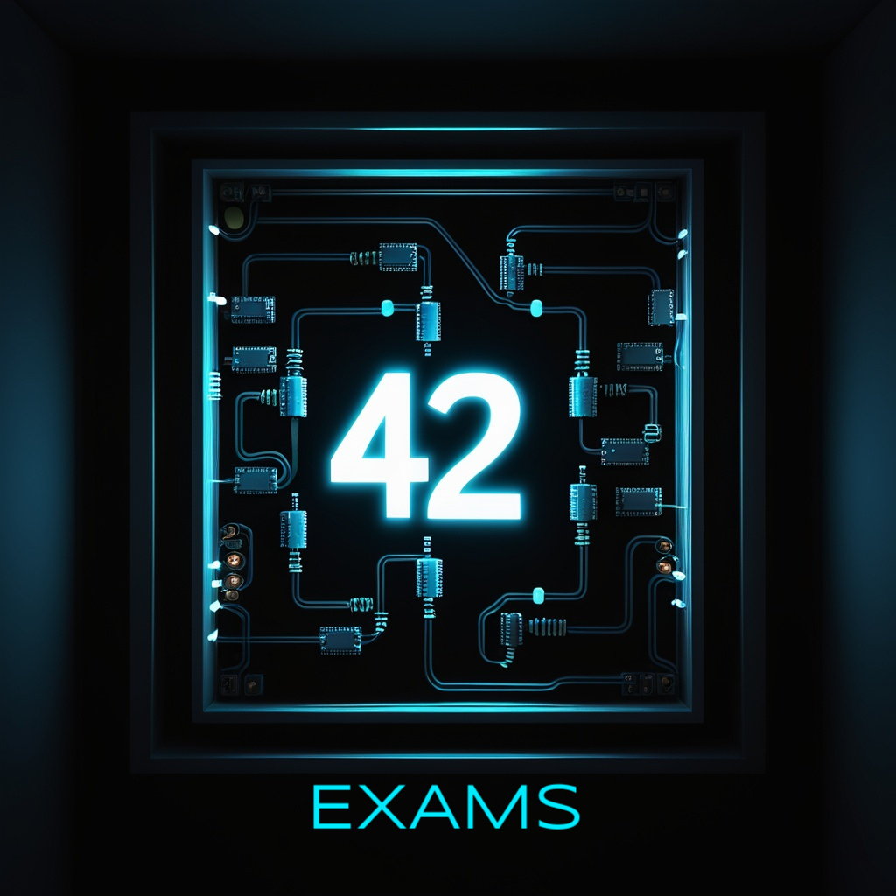
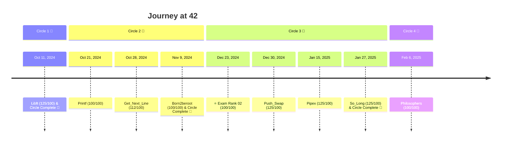

<h1>🎓 42 - My Journey Through the Common Core 🎓</h1>

<h3><i>Keep Swimming</i></h3>

<h2>🎯 ABOUT 🎯</h2>

This repository contains all my projects completed during the Common Core at 42 Lausanne. 
Each project represents a step in my learning journey, from basic C programming to complex system administration.

<h3><i>💡 Project banners are clickable and lead to their documentation 💡</i></h3>

<!-- First Circle -->
<table width="100%">
  <tr>
    <td width="50%" align="center">
      
    </td>
    <td width="50%">
      <table width="100%">
        <tr>
          <td width="50%" align="center">
            
          </td>
          <td width="50%" align="center">
            
          </td>
        </tr>
      </table>
    </td>
  </tr>
</table>

<!-- Second Circle -->
<table width="100%">
  <tr>
    <td width="50%" align="center">
      
    </td>
    <td width="50%">
      <table width="100%">
        <tr>
          <td width="50%" align="center">
            
          </td>
          <td width="50%" align="center">
            
          </td>
        </tr>
        <tr>
          <td width="50%" align="center">
            
          </td>
          <td width="50%" align="center">
            
          </td>
        </tr>
        <tr>
          <td width="50%" align="center">
            
          </td>
          <td width="50%" align="center">
            
          </td>
        </tr>
      </table>
    </td>
  </tr>
</table>

<!-- Third Circle -->
<table width="100%">
  <tr>
    <td width="50%" align="center">
      
    </td>
    <td width="50%">
      <table width="100%">
        <tr>
          <td width="50%" align="center">
            
          </td>
          <td width="50%" align="center">
            
          </td>
        </tr>
        <tr>
          <td width="50%" align="center">
            
          </td>
          <td width="50%" align="center">
            
          </td>
        </tr>
        <tr>
          <td width="50%" align="center">
            
          </td>
          <td width="50%" align="center">
            
          </td>
        </tr>
      </table>
    </td>
  </tr>
</table>

<!-- Fourth Circle -->
<table width="100%">
  <tr>
    <td width="50%" align="center">
      
    </td>
    <td width="50%">
      <table width="100%">
        <tr>
          <td width="50%" align="center">
            
          </td>
          <td width="50%" align="center">
            
          </td>
        </tr>
      </table>
    </td>
  </tr>
</table>

<!-- Exams -->
<table width="100%">
  <tr>
    <td width="50%" align="center">
      
    </td>
    <td width="50%">
      <table width="100%">
        <tr>
          <td>
            
            
          </td>
        </tr>
        <tr>
          <td align="center">
            ROTONE (25pts) | FT_STRDUP (25pts) 
            PGCD (25pts) | FT_ITOA (25pts)
          </td>
        </tr>
        <tr>
          <td align="center">
            <b>Validated on December 23, 2024</b>
          </td>
        </tr>
      </table>
    </td>
  </tr>
</table>

<h2>📊 Cursus Progress</h2>

<h2>💻 Tech Stack</h2>

