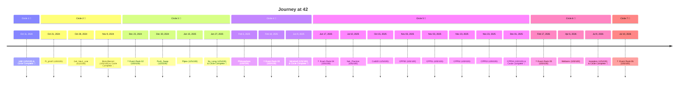

  

  

    <b>Every mandatory project of the Common Core at 42 Lausanne, from a blank <code>libft.h</code> to <code>ft_transcendence</code>.</b>
  

  

    
    
    
  

  

    
    
    
    
    
  

<h2 align="center">Overview</h2>

This repository is the index of every project I built during the Common Core at 42 Lausanne: from the first blank <code>libft.h</code> to network servers, containerized infrastructure, and the final <code>ft_transcendence</code>. Each entry below lives in its own repository, with its own README, its own subject, and its own grade.

<i>Project banners are clickable and lead to their own documentation.</i>

<h2 align="center">The Circles</h2>

| Circle | Projects | Status |
| --- | --- | :---: |
| 1 | Libft | ✅ |
| 2 | Ft_printf, GNL, Born2beroot | ✅ |
| 3 | Pipex, Push_swap, So_long | ✅ |
| 4 | Philosophers, Minishell | ✅ |
| 5 | Net_practice, Cub3D, CPP00-04 | ✅ |
| 6 | Webserv, Inception | ✅ |
| 7 | Ft_transcendence | 🚧 |

<table width="620">
<tr><th width="220">Project</th><th width="120">Grade</th></tr>

<tr><td colspan="2" align="right"></td></tr>
<tr><td align="left"></td><td align="center"></td></tr>

<tr><td colspan="2" align="right"></td></tr>
<tr><td align="left"></td><td align="center"></td></tr>
<tr><td align="left"></td><td align="center"></td></tr>
<tr><td align="left"></td><td align="center"></td></tr>

<tr><td colspan="2" align="right"></td></tr>
<tr><td align="left"></td><td align="center"></td></tr>
<tr><td align="left"></td><td align="center"></td></tr>
<tr><td align="left"></td><td align="center"></td></tr>

<tr><td colspan="2" align="right"></td></tr>
<tr><td align="left"></td><td align="center"></td></tr>
<tr><td align="left"></td><td align="center"></td></tr>

<tr><td colspan="2" align="right"></td></tr>
<tr><td align="left"></td><td align="center"></td></tr>
<tr><td align="left"></td><td align="center"></td></tr>
<tr><td align="left"></td><td align="center"></td></tr>
<tr><td align="left"></td><td align="center"></td></tr>
<tr><td align="left"></td><td align="center"></td></tr>
<tr><td align="left"></td><td align="center"></td></tr>
<tr><td align="left"></td><td align="center"></td></tr>

<tr><td colspan="2" align="right"></td></tr>
<tr><td align="left"></td><td align="center"></td></tr>
<tr><td align="left"></td><td align="center"></td></tr>

<tr><td colspan="2" align="right"></td></tr>
<tr><td align="left"></td><td align="center"></td></tr>
<tr><td align="left"></td><td align="center"></td></tr>
<tr><td align="left"></td><td align="center"></td></tr>
<tr><td align="left"></td><td align="center"></td></tr>
<tr><td align="left"></td><td align="center"></td></tr>
</table>

<h2 align="center">Progress</h2>

```mermaid
timeline
    title Journey at 42
    section Circle 1 🌟
        Oct 11, 2024 : Libft (125/100) & Circle Complete 🎯
	section Circle 2 🌟
        Oct 21, 2024 : Ft_printf (100/100)
        Oct 28, 2024 : Get_Next_Line (112/100)
        Nov 9, 2024 : Born2beroot (100/100) & Circle Complete 🎯
    section Circle 3 🌟
        Dec 23, 2024 : ⭐ Exam Rank 02 (100/100)
        Dec 30, 2024 : Push_Swap (125/100)
        Jan 15, 2025 : Pipex (125/100)
        Jan 27, 2025 : So_Long (125/100) & Circle Complete 🎯
    section Circle 4 🌟
        Feb 6, 2025 : Philosophers (100/100)
        Feb 18, 2025 : ⭐ Exam Rank 03 (100/100)
        Jun 9, 2025 : Minishell (125/100) & Circle Complete 🎯
    section Circle 5 🌟
        Jun 17, 2025 : ⭐ Exam Rank 04 (100/100)
        Jul 10, 2025 : Net_Practice (100/100)
        Oct 15, 2025 : Cub3D (125/100)
        Nov 03, 2025 : CPP00 (100/100)
        Nov 03, 2025 : CPP01 (100/100)
        Nov 23, 2025 : CPP02 (100/100)
        Nov 23, 2025 : CPP03 (100/100)
        Dec 01, 2025 : CPP04 (100/100) & Circle Complete 🎯
    section Circle 6 🌟
        Feb 17, 2026 : ⭐ Exam Rank 05 (100/100)
        Apr 6, 2026 : Webserv (100/100)
        Jul 9, 2026 : Inception (125/100) & Circle Complete 🎯
    section Circle 7 🌟
        Jul 10, 2026 : ⭐ Exam Rank 06 (100/100)
```

<h2 align="center">Currently Working On</h2>

<i>The final Common Core project.</i>

 

<h2 align="center">Tech Stack</h2>

            

42 Lausanne · Common Core

