

  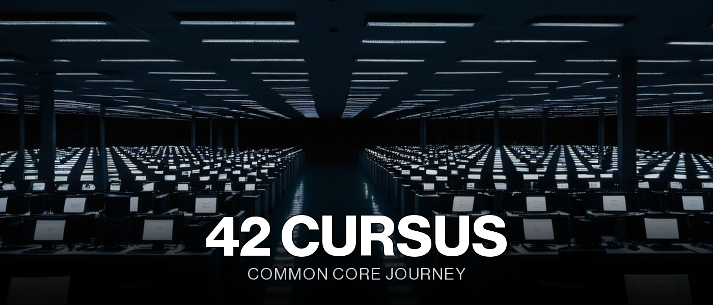

  

    <b>Every mandatory project of the Common Core at 42 Lausanne, from a blank <code>libft.h</code> to <code>ft_transcendence</code>.</b>
  

  

    
    
    
  

  

    
    
    
    
    
  

<h2 align="center">Overview</h2>

This repository is the index of every project I built during the Common Core at 42 Lausanne: from the first blank <code>libft.h</code> to network servers, containerized infrastructure, and the final <code>ft_transcendence</code>. Each entry below lives in its own repository, with its own README, its own subject, and its own grade.

<i>Project banners are clickable and lead to their own documentation.</i>

<h2 align="center">The Circles</h2>

| Circle | Projects | Status |
| --- | --- | :---: |
| 1 | Libft | ✅ |
| 2 | Ft_printf, GNL, Born2beroot | ✅ |
| 3 | Pipex, Push_swap, So_long | ✅ |
| 4 | Philosophers, Minishell | ✅ |
| 5 | Net_practice, Cub3D, CPP00-04 | ✅ |
| 6 | CPP05-09, Webserv, Inception | ✅ |
| 7 | Ft_transcendence | 🚧 |

<table width="100%">
<tr><th width="18%">Project</th><th>Description</th><th width="14%">Grade</th></tr>

<tr><td colspan="3" align="right"></td></tr>
<tr><td align="center"><a href="https://github.com/Nesplee/LIBFT#readme">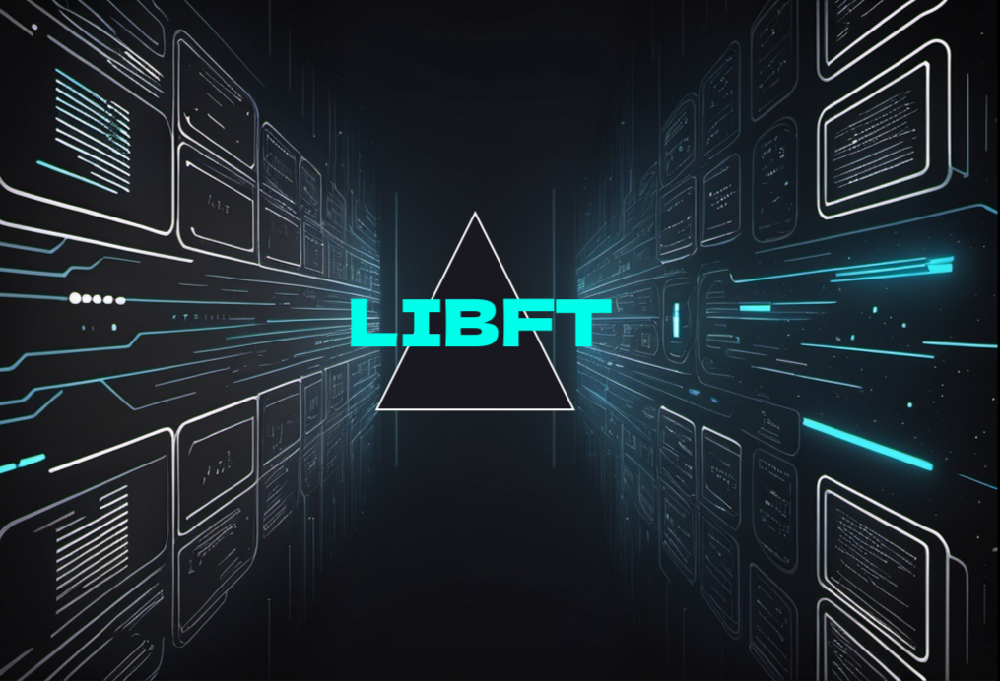</a></td><td>From-scratch reimplementation of the C standard library: strings, memory, linked lists, <code>get_next_line</code>, <code>ft_printf</code></td><td align="center"></td></tr>

<tr><td colspan="3" align="right"></td></tr>
<tr><td align="center"><a href="https://github.com/Nesplee/FT_PRINTF#readme">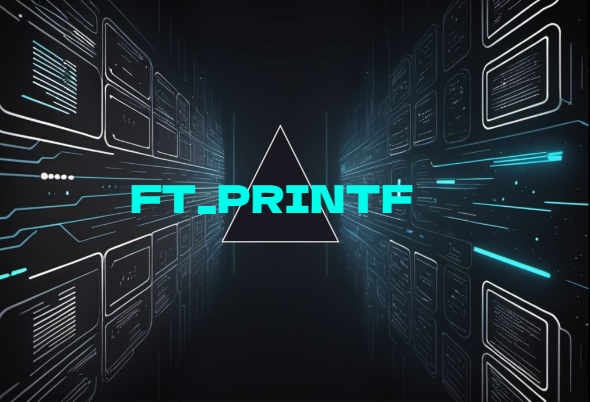</a></td><td>A <code>printf</code>-style formatter rebuilt from the man pages, variadic arguments and all</td><td align="center">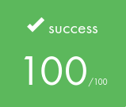</td></tr>
<tr><td align="center"></td><td>Reads a file descriptor line by line with a static buffer, independent of file size</td><td align="center">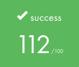</td></tr>
<tr><td align="center"><a href="https://github.com/Nesplee/BORN2BEROOT#readme">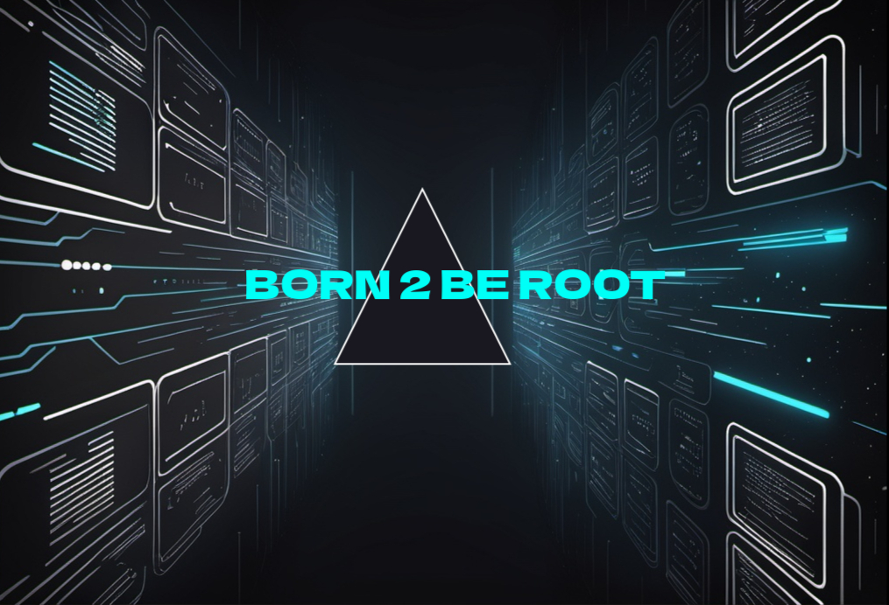</a></td><td>Hardened Debian VM: LVM encryption, UFW, SUDO policy, password aging, a custom monitoring script</td><td align="center"></td></tr>

<tr><td colspan="3" align="right"></td></tr>
<tr><td align="center"><a href="https://github.com/Nesplee/PIPEX#readme">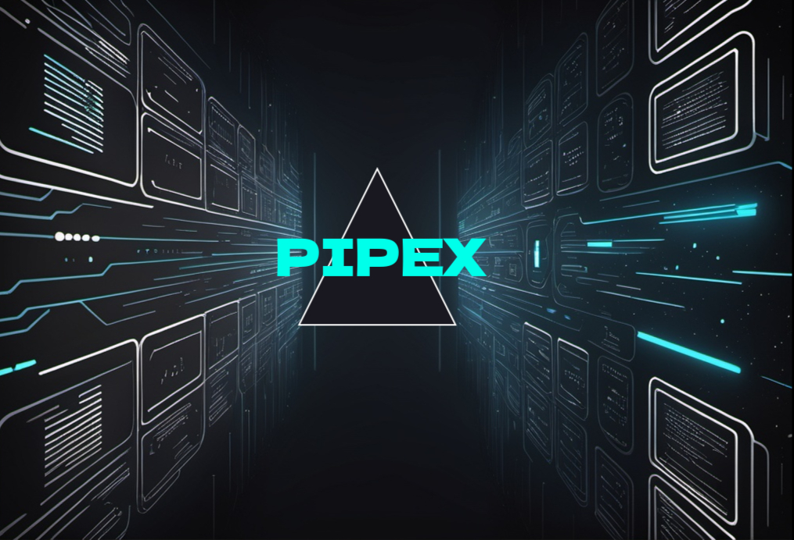</a></td><td>Reimplements shell pipe chaining (<code>cmd1 | cmd2</code>) using <code>fork</code>, <code>pipe</code>, and <code>execve</code></td><td align="center"></td></tr>
<tr><td align="center"><a href="https://github.com/Nesplee/PUSH_SWAP#readme">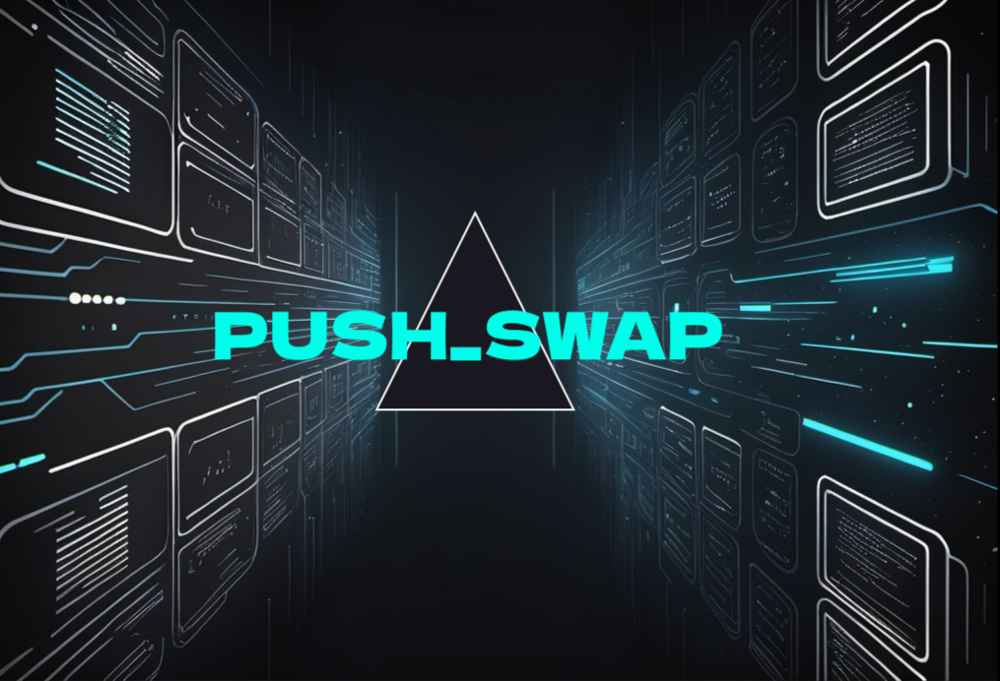</a></td><td>Sorts a stack of integers with two stacks and a minimal set of moves, algorithmic complexity under scrutiny</td><td align="center"></td></tr>
<tr><td align="center"><a href="https://github.com/Nesplee/SO_LONG#readme">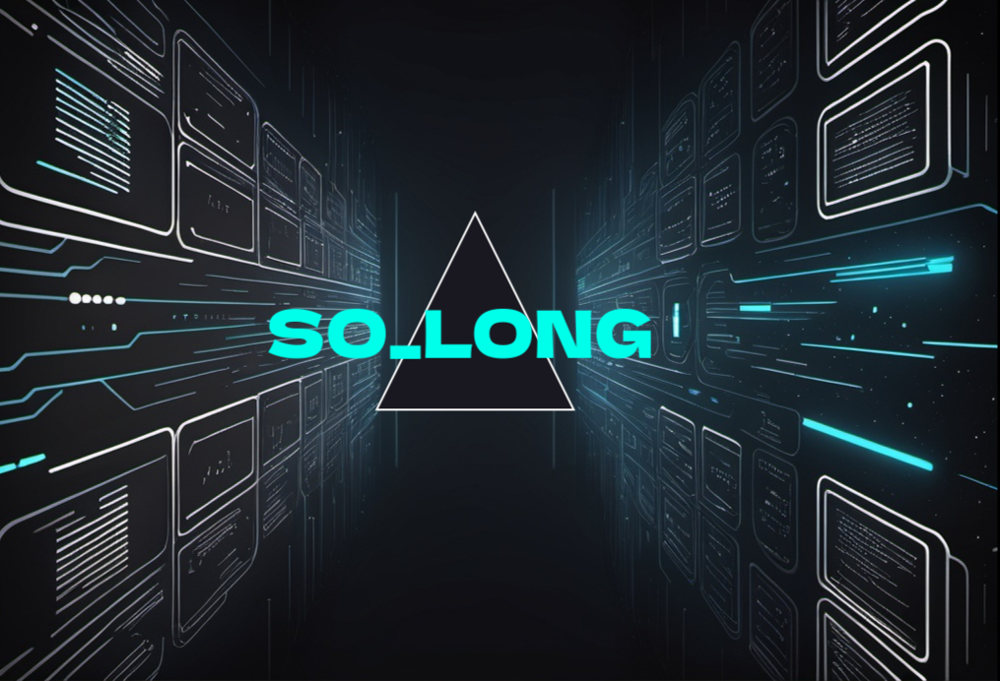</a></td><td>A small 2D tile-based game built on MiniLibX: sprites, collisions, a collectible-driven win condition</td><td align="center"></td></tr>
<tr><td align="center"><a href="/EXAMS/EXAM_RANK_02/">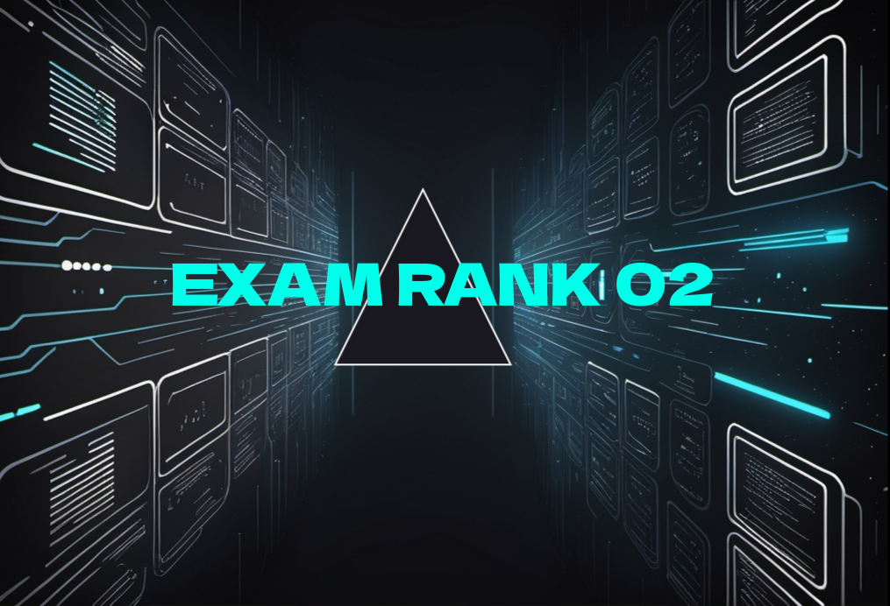</a></td><td>Supervised exam, no notes, no help: C fundamentals under time pressure</td><td align="center"></td></tr>

<tr><td colspan="3" align="right">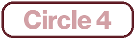</td></tr>
<tr><td align="center"><a href="https://github.com/Nesplee/PHILOSOPHERS">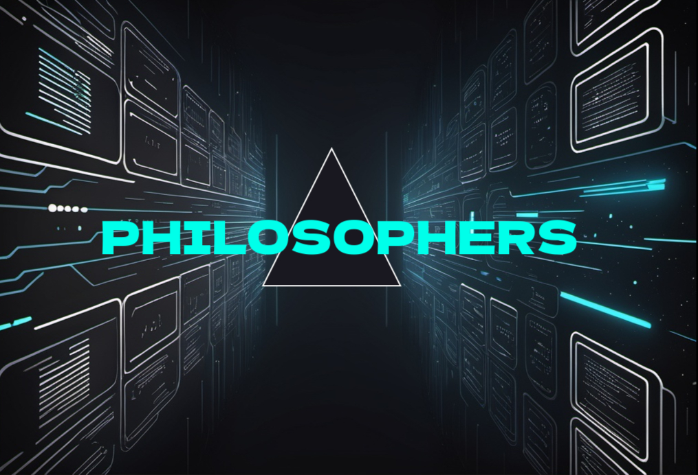</a></td><td>The dining philosophers problem: threads, mutexes, and deadlock/starvation avoidance under a hard timing constraint</td><td align="center"></td></tr>
<tr><td align="center"><a href="https://github.com/Nesplee/MINISHELL">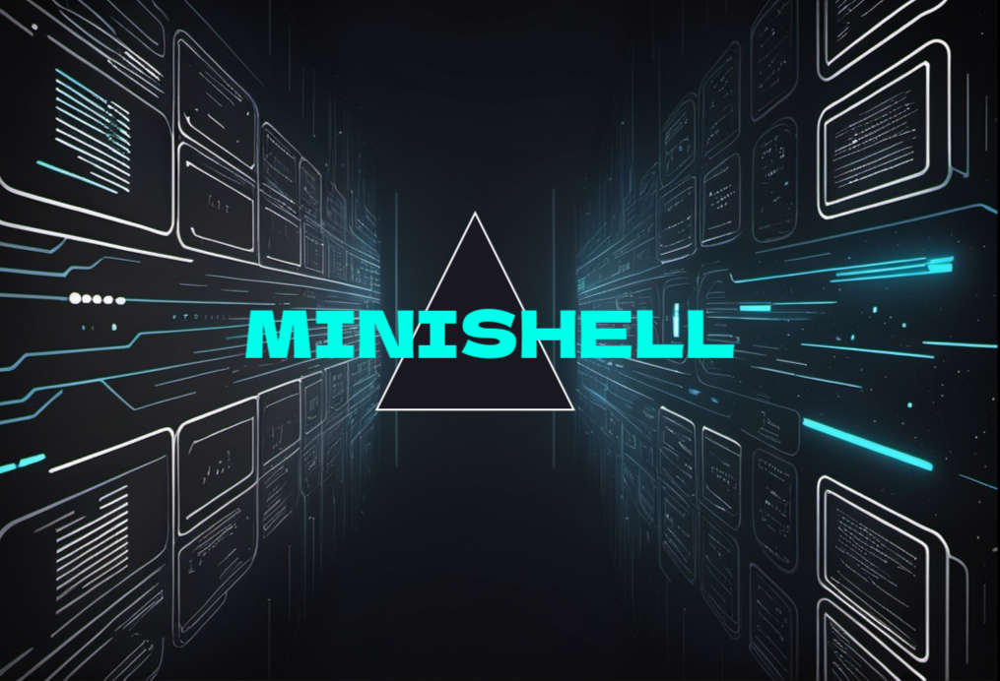</a></td><td>A working Bash-like shell: parsing, pipes, redirections, builtins, and signal handling</td><td align="center"></td></tr>
<tr><td align="center"></td><td>Supervised exam: pointers, recursion, and structured algorithms</td><td align="center"></td></tr>

<tr><td colspan="3" align="right"></td></tr>
<tr><td align="center"><a href="https://github.com/Nesplee/NET_PRACTICE#readme">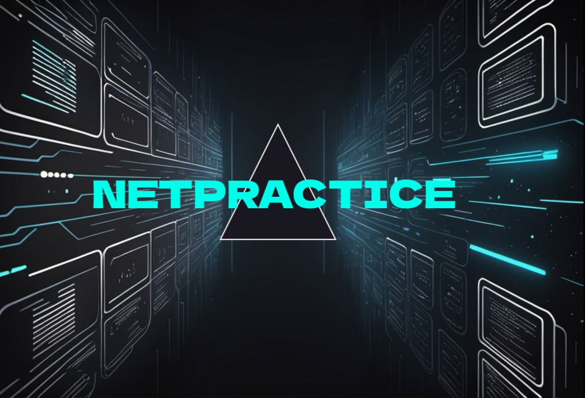</a></td><td>Network topology exercises: subnetting, static routing, and troubleshooting a broken configuration</td><td align="center"></td></tr>
<tr><td align="center"><a href="https://github.com/Nesplee/CUB3D#readme">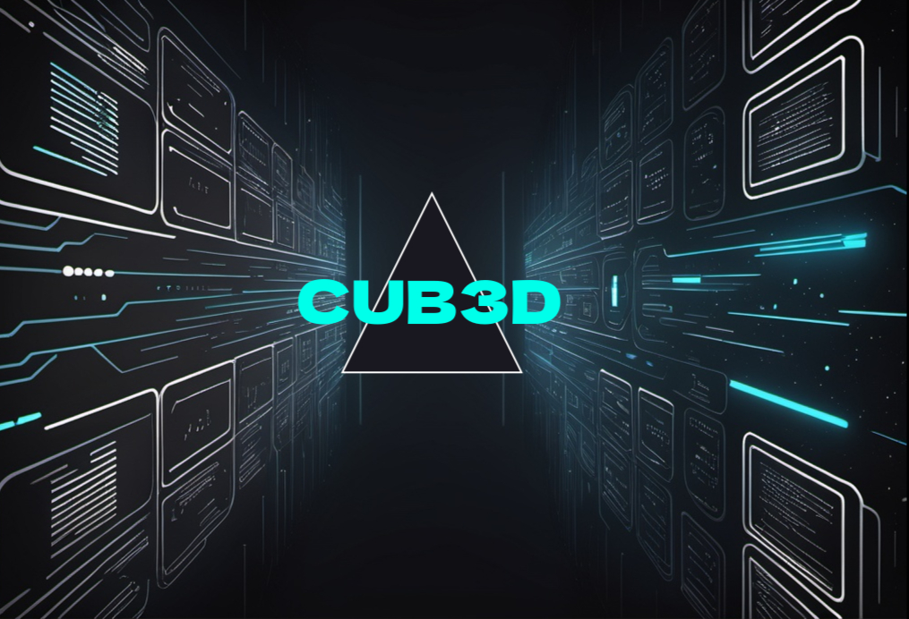</a></td><td>A Wolfenstein-style raycasting engine in C, from the DDA algorithm to textured walls and sprites</td><td align="center"></td></tr>
<tr><td align="center"></td><td>CPP00: namespaces, classes, member functions, and the orthodox canonical form</td><td align="center"></td></tr>
<tr><td align="center"></td><td>CPP01: memory allocation, references, pointers to members, and Switch design pattern</td><td align="center"></td></tr>
<tr><td align="center"><a href="https://github.com/Nesplee/CPP#readme">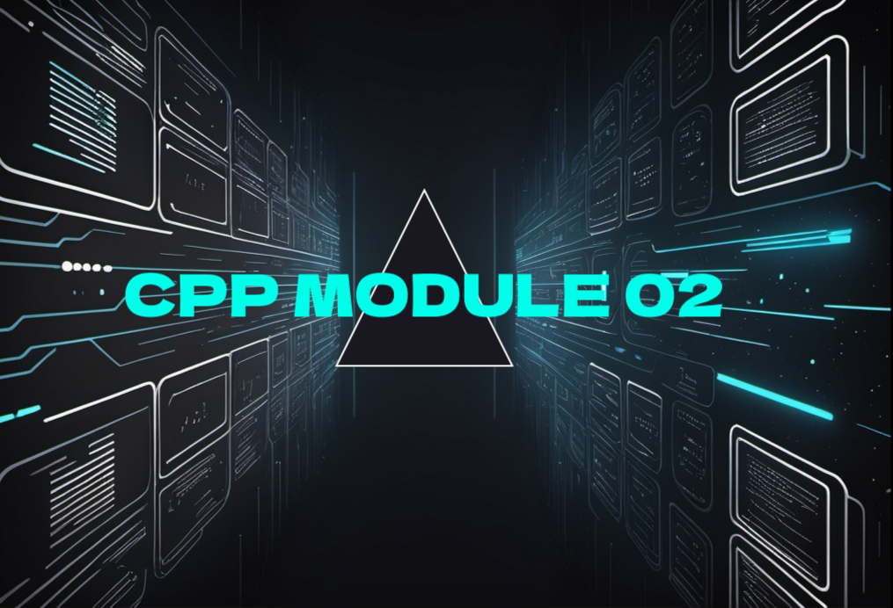</a></td><td>CPP02: ad-hoc polymorphism, operator overloading, and a fixed-point number class</td><td align="center"></td></tr>
<tr><td align="center"><a href="https://github.com/Nesplee/CPP#readme">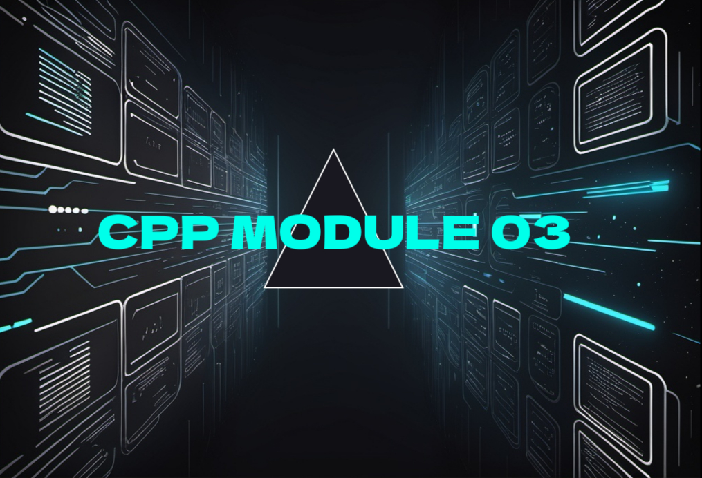</a></td><td>CPP03: inheritance, from a simple base class to a small multi-level hierarchy</td><td align="center"></td></tr>
<tr><td align="center"></td><td>CPP04: subtype polymorphism, abstract classes, and interfaces</td><td align="center"></td></tr>
<tr><td align="center"></td><td>Supervised exam: more advanced C, closer to the level required by Minishell</td><td align="center"></td></tr>

<tr><td colspan="3" align="right">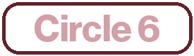</td></tr>
<tr><td align="center"></td><td>CPP05: exceptions, and a small orthodox canonical class hierarchy that throws them</td><td align="center"></td></tr>
<tr><td align="center"></td><td>CPP06: type conversion, from C-style casts to <code>static_cast</code>, <code>dynamic_cast</code>, and <code>reinterpret_cast</code></td><td align="center"></td></tr>
<tr><td align="center"></td><td>CPP07: templates, function and class templates replacing repetitive overloads</td><td align="center"></td></tr>
<tr><td align="center"><a href="https://github.com/Nesplee/CPP#readme">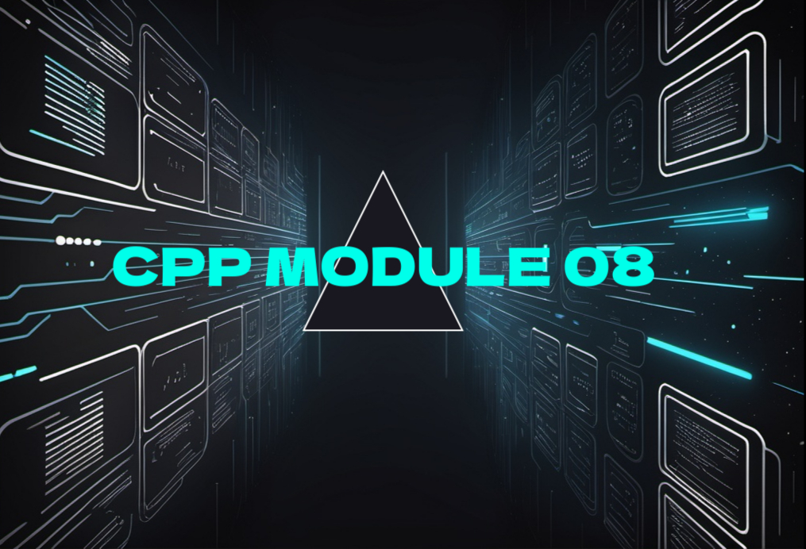</a></td><td>CPP08: the STL, templated containers, iterators, and algorithms</td><td align="center"></td></tr>
<tr><td align="center"><a href="https://github.com/Nesplee/CPP#readme">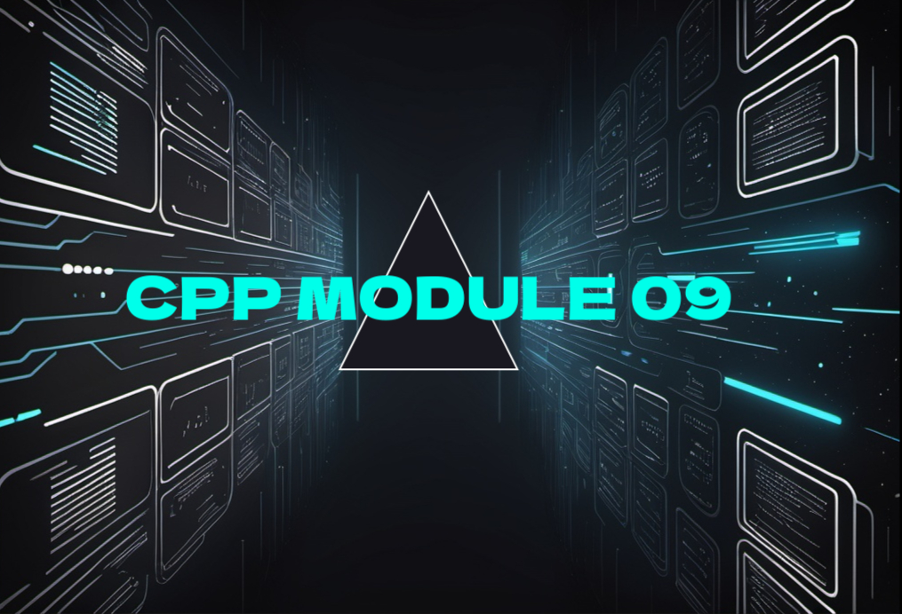</a></td><td>CPP09: a small standalone program applying the STL to a real parsing/data problem</td><td align="center"></td></tr>
<tr><td align="center"></td><td>Non-blocking HTTP/1.1 server in C++98: static files, CGI, uploads, multiple virtual hosts, config-driven like NGINX</td><td align="center"></td></tr>
<tr><td align="center"><a href="https://github.com/Nesplee/INCEPTION#readme">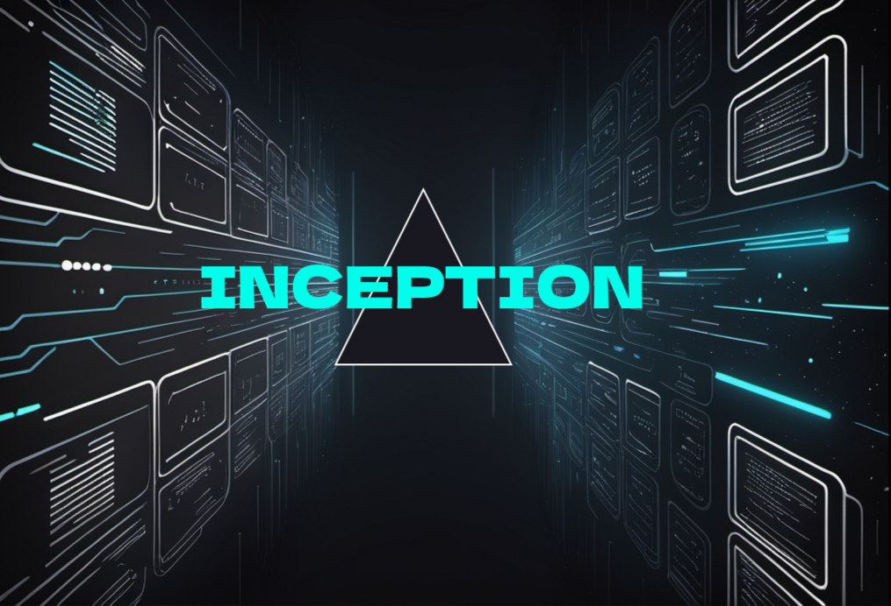</a></td><td>Multi-service Docker infrastructure: NGINX with TLS, WordPress, MariaDB, plus FTP, Redis, and n8n as bonus services</td><td align="center"></td></tr>
<tr><td align="center"><a href="/EXAMS/EXAM_RANK_05/">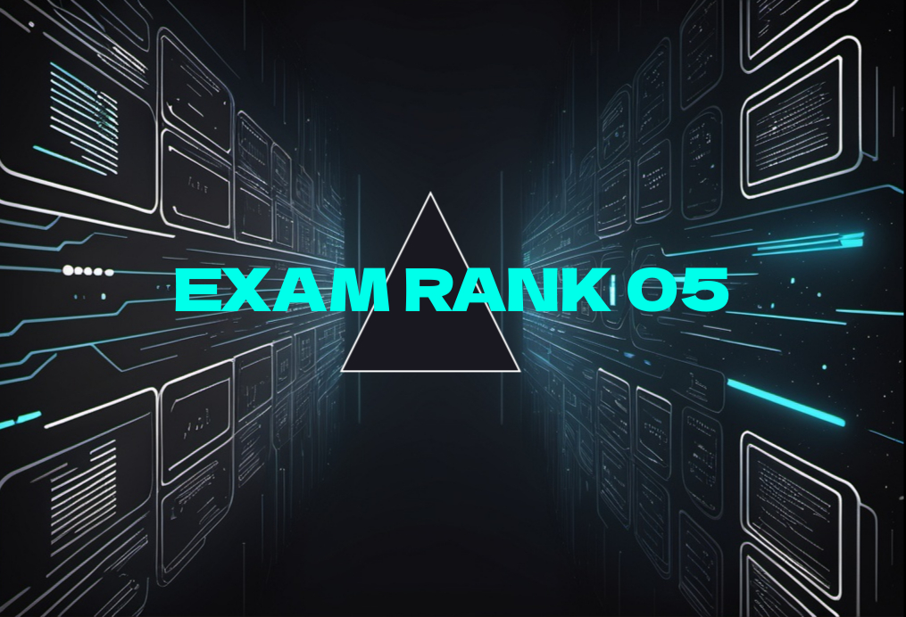</a></td><td>Supervised exam gating access to the systems and network track</td><td align="center"></td></tr>

<tr><td colspan="3" align="right">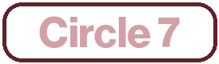</td></tr>
<tr><td align="center"></td><td>Supervised exam gating access to the final Common Core project</td><td align="center"></td></tr>
</table>

<h2 align="center">Progress</h2>

```mermaid
timeline
    title Journey at 42
    section Circle 1 🌟
        Oct 11, 2024 : Libft (125/100) & Circle Complete 🎯
	section Circle 2 🌟
        Oct 21, 2024 : Ft_printf (100/100)
        Oct 28, 2024 : Get_Next_Line (112/100)
        Nov 9, 2024 : Born2beroot (100/100) & Circle Complete 🎯
    section Circle 3 🌟
        Dec 23, 2024 : ⭐ Exam Rank 02 (100/100)
        Dec 30, 2024 : Push_Swap (125/100)
        Jan 15, 2025 : Pipex (125/100)
        Jan 27, 2025 : So_Long (125/100) & Circle Complete 🎯
    section Circle 4 🌟
        Feb 6, 2025 : Philosophers (100/100)
        Feb 18, 2025 : ⭐ Exam Rank 03 (100/100)
        Jun 9, 2025 : Minishell (125/100) & Circle Complete 🎯
    section Circle 5 🌟
        Jun 17, 2025 : ⭐ Exam Rank 04 (100/100)
        Jul 10, 2025 : Net_Practice (100/100)
        Oct 15, 2025 : Cub3D (125/100)
        Nov 03, 2025 : CPP00 (100/100)
        Nov 03, 2025 : CPP01 (100/100)
        Nov 23, 2025 : CPP02 (100/100)
        Nov 23, 2025 : CPP03 (100/100)
        Dec 01, 2025 : CPP04 (100/100) & Circle Complete 🎯
    section Circle 6 🌟
        Feb 17, 2026 : ⭐ Exam Rank 05 (100/100)
        Apr 6, 2026 : CPP05-09 (100/100)
        Apr 6, 2026 : Webserv (100/100)
        Jul 9, 2026 : Inception (125/100) & Circle Complete 🎯
    section Circle 7 🌟
        Jul 10, 2026 : ⭐ Exam Rank 06 (100/100)
```

<h2 align="center">Currently Working On</h2>

<i>The final Common Core project.</i>

 

<h2 align="center">Tech Stack</h2>

            

42 Lausanne · Common Core

