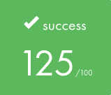

<h1>🎓 42 - My Journey Through the Common Core 🎓</h1>

<h3><i>Keep Working</i></h3>

<h2>🎯 ABOUT 🎯</h2>

This repository contains all my projects completed during the Common Core at 42 Lausanne. 
Each project represents a step in my learning journey, from basic C programming to complex system administration.

<h3><i>💡 Project banners are clickable and lead to their documentation 💡</i></h3>

<!-- First Circle -->
<table width="100%">
  <tr>
    <td width="50%" align="center">
      
    </td>
    <td width="50%">
      <table width="100%">
        <tr>
          <td width="50%" align="center">
            
          </td>
          <td width="50%" align="center">
            
          </td>
        </tr>
      </table>
    </td>
  </tr>
</table>

<!-- Second Circle -->
<table width="100%">
  <tr>
    <td width="50%" align="center">
      
    </td>
    <td width="50%">
      <table width="100%">
        <tr>
          <td width="50%" align="center">
            
          </td>
          <td width="50%" align="center">
            
          </td>
        </tr>
        <tr>
          <td width="50%" align="center">
            
          </td>
          <td width="50%" align="center">
            
          </td>
        </tr>
        <tr>
          <td width="50%" align="center">
            
          </td>
          <td width="50%" align="center">
            
          </td>
        </tr>
      </table>
    </td>
  </tr>
</table>

<!-- Third Circle -->
<table width="100%">
  <tr>
    <td width="50%" align="center">
      
    </td>
    <td width="50%">
      <table width="100%">
        <tr>
          <td width="50%" align="center">
            
          </td>
          <td width="50%" align="center">
            
          </td>
        </tr>
        <tr>
          <td width="50%" align="center">
            
          </td>
          <td width="50%" align="center">
            
          </td>
        </tr>
        <tr>
          <td width="50%" align="center">
            
          </td>
          <td width="50%" align="center">
            
          </td>
        </tr>
      </table>
    </td>
  </tr>
</table>

<!-- Fourth Circle -->
<table width="100%">
  <tr>
    <td width="50%" align="center">
      
    </td>
    <td width="50%">
      <table width="100%">
        <tr>
          <td width="50%" align="center">
            
          </td>
          <td width="50%" align="center">
            
          </td>
        </tr>
      </table>
    </td>
  </tr>
</table>

<!-- Exams -->
<table width="100%">
  <tr>
    <td width="50%" align="center">
      
    </td>
    <td width="50%">
      <table width="100%">
        <tr>
          <td>
            
            
          </td>
        </tr>
        <tr>
          <td align="center">
            ROTONE (25pts) | FT_STRDUP (25pts) 
            PGCD (25pts) | FT_ITOA (25pts)
          </td>
        </tr>
        <tr>
          <td align="center">
            <b>Validated on December 23, 2024</b>
          </td>
        </tr>
      </table>
    </td>
  </tr>
</table>

<h2>📊 Journey Progress</h2>

<svg width="800" height="300" style="background: white;">
    <!-- Axe horizontal -->
    <line x1="50" y1="250" x2="750" y2="250" stroke="#333" stroke-width="2"/>

    <!-- Axe vertical -->
    <line x1="50" y1="50" x2="50" y2="250" stroke="#333" stroke-width="2"/>

    <!-- Points des projets -->
    <circle cx="100" cy="220" r="5" fill="#00BABC"/> <!-- Libft -->
    <circle cx="200" cy="200" r="5" fill="#00BABC"/> <!-- Printf -->
    <circle cx="250" cy="180" r="5" fill="#00BABC"/> <!-- GNL -->
    <circle cx="300" cy="160" r="8" fill="gold"/> <!-- B2BR + Fin Circle 1 -->
    <circle cx="400" cy="140" r="5" fill="#00BABC"/> <!-- Push_swap -->
    <circle cx="450" cy="120" r="6" fill="#FF4242"/> <!-- Exam 02 -->
    <circle cx="500" cy="100" r="5" fill="#00BABC"/> <!-- Pipex -->
    <circle cx="600" cy="80" r="8" fill="gold"/> <!-- So_long + Fin Circle 2 -->
    <circle cx="700" cy="60" r="5" fill="#00BABC"/> <!-- Philo -->

    <!-- Ligne de progression -->
    <path d="M100,220 L200,200 L250,180 L300,160 L400,140 L450,120 L500,100 L600,80 L700,60"
          stroke="#00BABC"
          fill="none"
          stroke-width="2"/>

    <!-- Dates -->
    <text x="90" y="270" font-size="12">Oct 11</text>
    <text x="190" y="270" font-size="12">Oct 21</text>
    <text x="240" y="270" font-size="12">Oct 28</text>
    <text x="290" y="270" font-size="12">Nov 9</text>
    <text x="390" y="270" font-size="12">Dec 30</text>
    <text x="440" y="270" font-size="12">Dec 23</text>
    <text x="490" y="270" font-size="12">Jan 15</text>
    <text x="590" y="270" font-size="12">Jan 27</text>
    <text x="690" y="270" font-size="12">Feb 6</text>

    <!-- Légende -->
    <circle cx="50" cy="20" r="5" fill="#00BABC"/>
    <text x="65" y="25" font-size="12">Projects</text>
    <circle cx="150" cy="20" r="6" fill="#FF4242"/>
    <text x="165" y="25" font-size="12">Exams</text>
    <circle cx="250" cy="20" r="8" fill="gold"/>
    <text x="265" y="25" font-size="12">Circle Completion</text>
</svg>

