```mermaid
timeline
    title Journey at 42
    section Circle 1 🌟
        Oct 11, 2024 : Libft (125/100) & Circle Complete 🎯
	section Circle 2 🌟
        Oct 21, 2024 : Ft_printf (100/100)
        Oct 28, 2024 : Get_Next_Line (112/100)
        Nov 9, 2024 : Born2beroot (100/100) & Circle Complete 🎯
    section Circle 3 🌟
        Dec 23, 2024 : ⭐ Exam Rank 02 (100/100)
        Dec 30, 2024 : Push_Swap (125/100)
        Jan 15, 2025 : Pipex (125/100)
        Jan 27, 2025 : So_Long (125/100) & Circle Complete 🎯
    section Circle 4 🌟
        Feb 6, 2025 : Philosophers (100/100)
        Feb 18, 2025 : ⭐ Exam Rank 03 (100/100)
		Jun 9, 2025 : Minishell (125/100) & Circle Complete 🎯
	section Circle 5 🌟
        Jun 17, 2025 : ⭐ Exam Rank 04 (100/100)
        Jul 10, 2025 : Net_Practice (100/100)
        Oct 15, 2025 : Cub3D (125/100)
        Nov 03, 2025 : CPP00 (100/100)
        Nov 03, 2025 : CPP01 (100/100)
        Nov 23, 2025 : CPP02 (100/100)
        Nov 23, 2025 : CPP03 (100/100)
        Dec 01, 2025 : CPP04 (100/100) & Circle Complete 🎯
```

<h1>🎓 42 - My Journey Through the Common Core 🎓</h1>

 

<h3><i>TRYING NOT TO SINK SINCE</i></h3>

<h2>🎯 ABOUT 🎯</h2>

This repository contains all my projects completed during the Common Core at 42 Lausanne. 
Each project represents a step in my learning journey, from basic C programming to complex system administration.

<h3><i>💡 Project banners are clickable and lead to their documentation 💡</i></h3>

<!-- First Circle -->
<table width="100%">
  <tr>
    <td width="50%" align="center">
      
    </td>
    <td width="50%">
      <table width="100%">
        <tr>
          <td width="50%" align="center">
            
          </td>
          <td width="50%" align="center">
            
          </td>
        </tr>
      </table>
    </td>
  </tr>
</table>

<!-- Second Circle -->
<table width="100%">
  <tr>
    <td width="50%" align="center">
      
    </td>
    <td width="50%">
      <table width="100%">
        <tr>
          <td width="50%" align="center">
            
          </td>
          <td width="50%" align="center">
            
          </td>
        </tr>
        <tr>
          <td width="50%" align="center">
            
          </td>
          <td width="50%" align="center">
            
          </td>
        </tr>
        <tr>
          <td width="50%" align="center">
            
          </td>
          <td width="50%" align="center">
            
          </td>
        </tr>
      </table>
    </td>
  </tr>
</table>

<!-- Third Circle -->
<table width="100%">
  <tr>
    <td width="50%" align="center">
      
    </td>
    <td width="50%">
      <table width="100%">
        <tr>
          <td width="50%" align="center">
            
          </td>
          <td width="50%" align="center">
            
          </td>
        </tr>
        <tr>
          <td width="50%" align="center">
            
          </td>
          <td width="50%" align="center">
            
          </td>
        </tr>
        <tr>
          <td width="50%" align="center">
            
          </td>
          <td width="50%" align="center">
            
          </td>
        </tr>
      </table>
    </td>
  </tr>
</table>

<!-- Fourth Circle -->
<table width="100%">
  <tr>
    <td width="50%" align="center">
      
    </td>
    <td width="50%">
      <table width="100%">
        <tr>
          <td width="50%" align="center">
            
          </td>
          <td width="50%" align="center">
            
          </td>
        </tr>
        <tr>
          <td width="50%" align="center">
            
          </td>
          <td width="50%" align="center">
            
          </td>
        </tr>
      </table>
    </td>
  </tr>
</table>

<!-- Exams -->
<table width="100%">
  <tr>
    <td width="50%" align="center">
      
    </td>
    <td width="50%">
      <table width="100%">
        <tr>
          <td width="50%" align="center">
            
          </td>
          <td width="50%" align="center">
            
          </td>
        </tr>
        <tr>
          <td width="50%" align="center">
            
          </td>
          <td width="50%" align="center">
            
          </td>
        </tr>
      </table>
    </td>
  </tr>
</table>

<h2>📈 Cursus Progress 📈</h2>

<h2>⌛ Actually working on ⌛</h2>

<h3>💻 Tech Stack 💻</h3>

