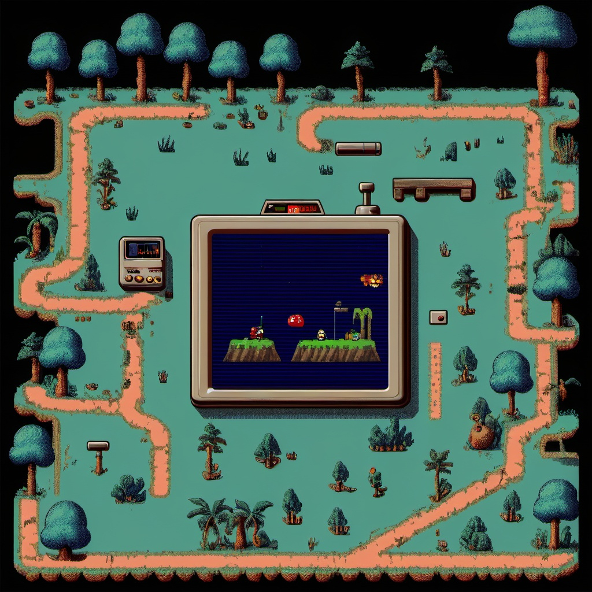
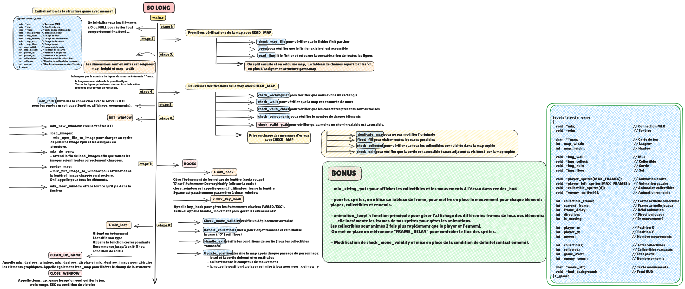
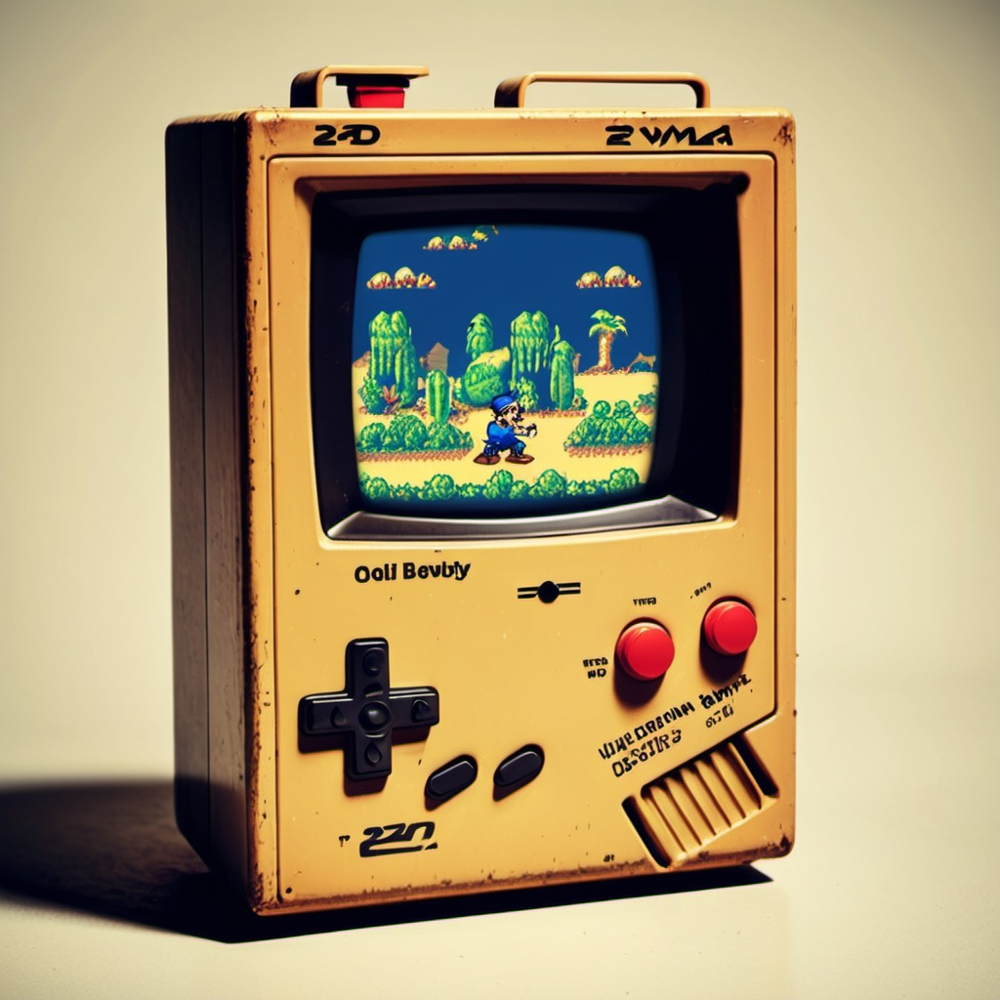

# 🎮 SO_LONG - A Small 2D Game 🎮

  

### *So long childhood games, now I make my own, like printf* 💡

## 🎯 ABOUT 🎯

This project is a small 2D game with MinilibX. You'll learn about textures, sprites and basic gameplay elements.
A perfect first step into game development at 42, mastering window management, events handling and sprite animation.

#### 📖 [Read the subject here](.assets/SO_LONG.pdf)

# 📚 Project Components

### 1. Core Functions 🎯
- [`main.c`](main.c) - Main program
- [`so_long.h`](so_long.h) - Header with definitions and prototypes

### 2. Map Management 🗺️
- [`map_read.c`](map_read.c) - Reading and validating .ber file
- [`map_check.c`](map_check.c) - Map validity checks
- [`map_check2.c`](map_check2.c) - Additional map validations
- [`map_path.c`](map_path.c) - Valid path verification (flood fill)

### 3. Game Logic 🎮
- [`game_moves.c`](game_moves.c) - Player movement handling
- [`map_render.c`](map_render.c) - Map and elements rendering
- [`window_handle.c`](window_handle.c) - MLX window management
- [`utils.c`](utils.c) - Utility functions

### 4. Bonus Features ⭐
#### Graphics Enhancement
- [`map_render_bonus.c`](bonus/map_render_bonus.c) - Enhanced rendering
- [`map_render2_bonus.c`](bonus/map_render2_bonus.c) - HUD and animations
- [`map_load_bonus.c`](bonus/map_load_bonus.c) - Sprite loading

#### Game Mechanics
- [`game_moves_bonus.c`](bonus/game_moves_bonus.c) - Enhanced movements
- [`game_hooks_bonus.c`](bonus/game_hooks_bonus.c) - Event handling

#### Map Features
- [`map_check_bonus.c`](bonus/map_check_bonus.c) - Extended validation
- [`map_check2_bonus.c`](bonus/map_check2_bonus.c) - Additional checks
- [`map_path_bonus.c`](bonus/map_path_bonus.c) - Enhanced pathfinding
- [`map_read_bonus.c`](bonus/map_read_bonus.c) - Advanced map reading

#### Utils & Memory Management
- [`utils_bonus.c`](bonus/utils_bonus.c) - Bonus utilities
- [`utils_free_bonus.c`](bonus/utils_free_bonus.c) - Advanced memory management

### 5. Additional Resources 📁
#### Map Examples
- [`test.ber`](maps/test.ber) - Basic test map
- [`test2.ber`](maps/test2.ber) - Advanced test map
- [`test3_bonus.ber`](maps/test3_bonus.ber) - Bonus features map

## 💭 Sketches

# 🎨 Game Assets

### Static Tiles 🏞️
| Asset | Description |
|:-----:|:------------|
|  | Wall tile |
|  | Floor tile |
|  | Exit door |

### Animations 🎬
| Asset | Preview |
|:-----:|:-------:|
| Player |  |
| Player Reverse |  |
| Collectibles |  |
| Enemies |  |

## 🔍 Project Details

  

| 🎯 Key Learning Outcomes | 🛠️ Skills Developed |
|:------------------------|:-------------------|
| • Window management • Events handling • Sprites & textures • Game design | • Graphics • Imperative programming • Game Dev • Algorithms |

### ⏰ Hours Spent: ~70 hours

## ⭐ Results

### Validated on January 27, 2025

